# Component GIF Catalog

This catalog collects every component GIF generated so far for the shared Manim component library.
Every entry is generated from the component demo manifest in `spikes/component-library-demos/main.py`,
so each component has a matching GIF and visible component name.

Regenerate the current set with:

```powershell
uv run --script spikes/component-library-demos/main.py --quality low
```

Source demos live in `spikes/component-library-demos/`. Full render outputs live in
`videos/component-library-demos/components/`. Doc-ready GIFs live in
`.specs/assets/component-demos/`.

## Current Components

| Component | Demo | Notes |
| --- | --- | --- |
| `slab` | 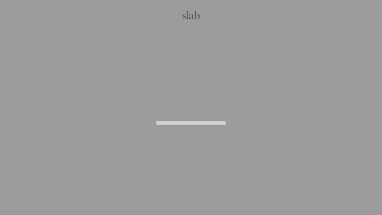 | Solid rectangular block used for bars, rails, cards, and resolved payloads. |
| `pulse` | 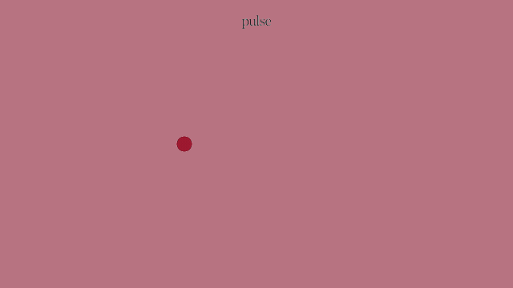 | Primary-red active actor used to carry handoffs, routes, and proof beats. |
| `open_slot` | 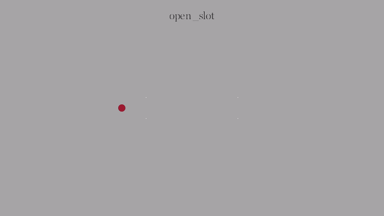 | Open receiver outline that reserves a destination without enclosing the actor. |
| `source_slot` | 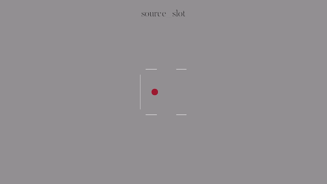 | Bracketed launch slot for a source-side active actor. |
| `target_slot` | 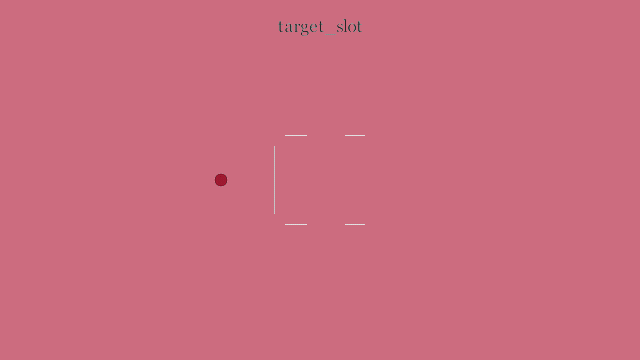 | Mirrored bracketed landing slot for a receiver-side active actor. |
| `bridge_lane` |  | Guided transfer lane between source and destination zones. |
| `gate_column` | 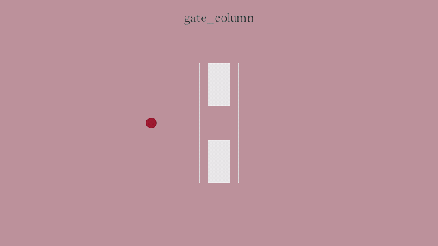 | Prepared vertical gate that opens around the active actor. |
| `time_rail` |  | Left-side timeline rail that narrates progressive card activation. |
| `mask_window` | 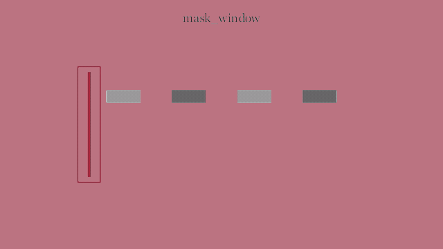 | Moving mask window that reveals transferred outputs. |
| `terminal_brackets` | 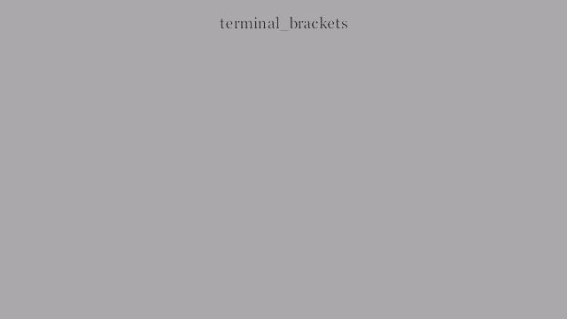 | Separated corner marks used as a terminal resolved-state cue. |
| `terminal_brackets_around` | 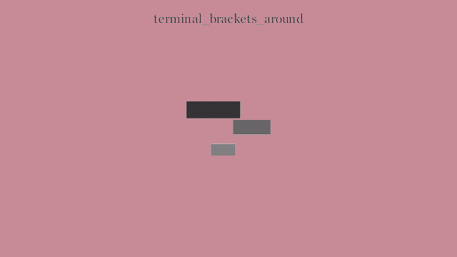 | Convenience wrapper that sizes terminal brackets around a target cluster. |
| `neutral_cluster` | 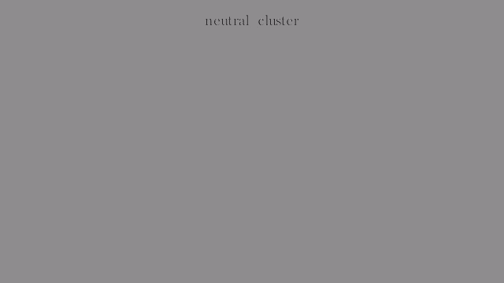 | Reusable quiet gray payload cluster for transfer and resolve demos. |
| `aperture_shutters` | 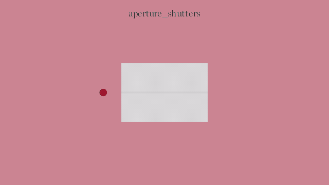 | Reusable opening shutters extracted from aperture-style transition spikes. |
| `merge_funnel` | 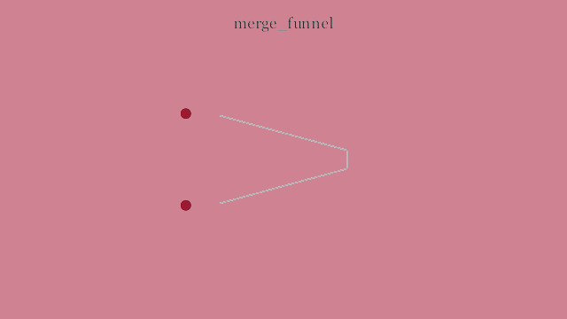 | Converging guide rails for combining two inputs into one output. |
| `orbit_guides` | 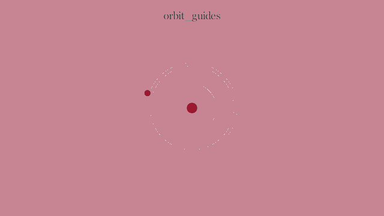 | Circular guide marks for anchored orbit and return-motion explanations. |
| `fork_guides` | 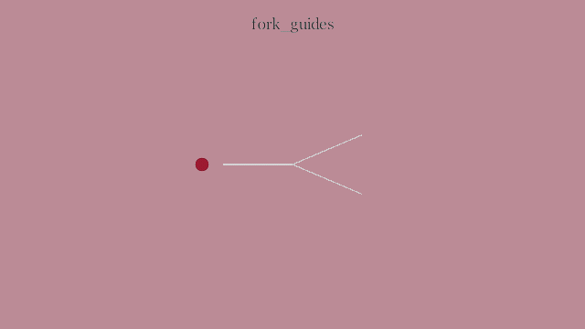 | Branching guide rails for diverging one active actor into parallel outcomes. |
| `pressure_wall` | 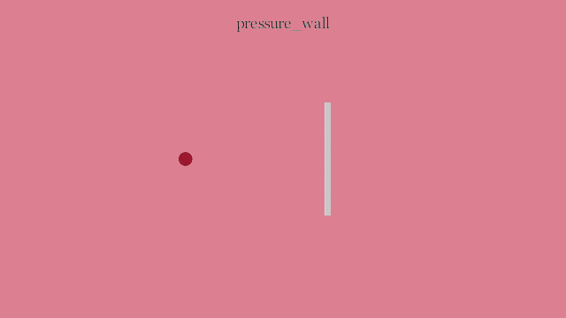 | Compact resistance marker for pressure, constraint, and boundary-contact scenes. |
| `clamp_pair` | 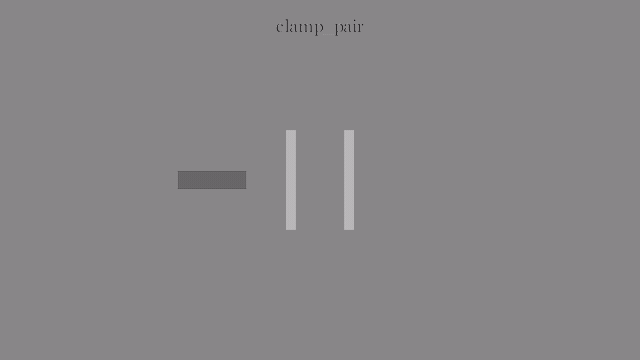 | Opposing vertical clamp bars extracted from compression and clamp-close spikes. |
| `sleeve_channel` | 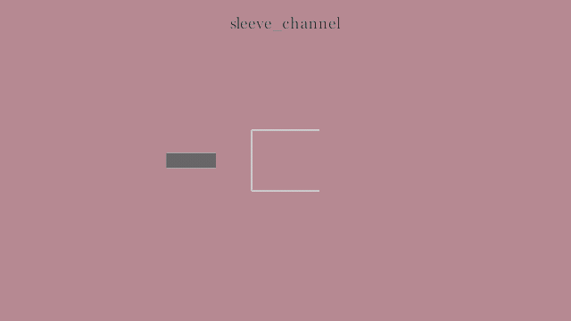 | Three-sided reveal sleeve for contained payload transitions. |
| `ramp_plane` | 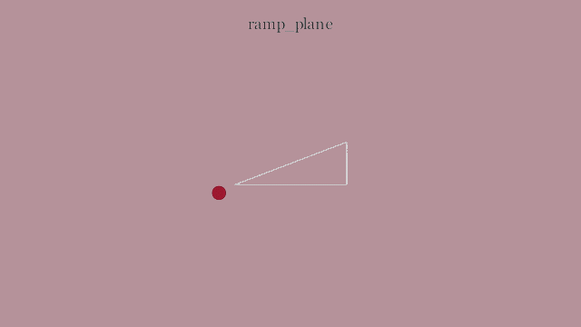 | Inclined support plane for lift, ramp, and assisted-transfer scenes. |
| `fan_guides` | 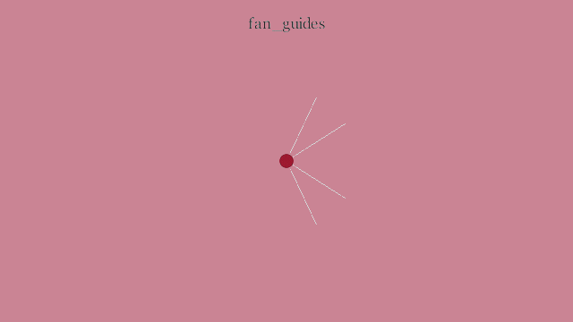 | Radial guide set for fan-out, splay, and multi-target distribution scenes. |
| `hinge_pivot` | 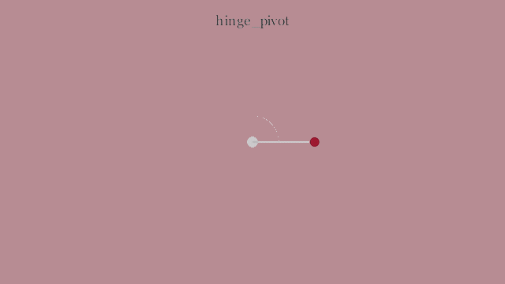 | Pivot, arm, and arc guide for hinge or swing-motion explanations. |
| `arc_handoff` | 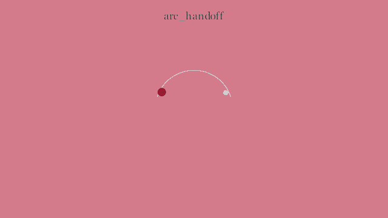 | Curved route with source and target points for arced handoff scenes. |
| `bumper_stop` | 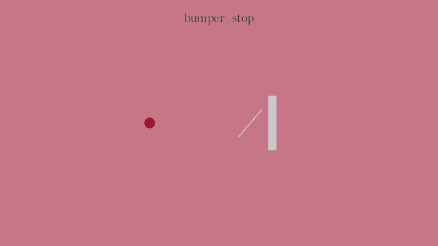 | Angled stop and wall for deflecting an active actor away from a boundary. |
| `compression_channel` | 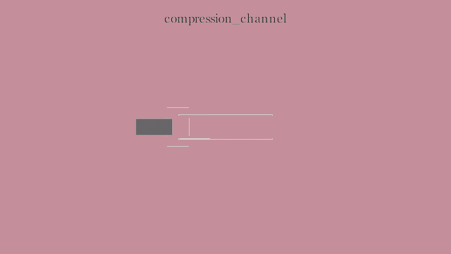 | Narrow parallel rails for squeezing or releasing a payload. |
| `corridor_rails` | 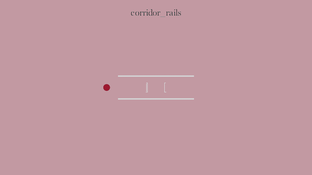 | Long guide rails with a central squeeze point for corridor passages. |
| `cradle_catch` | 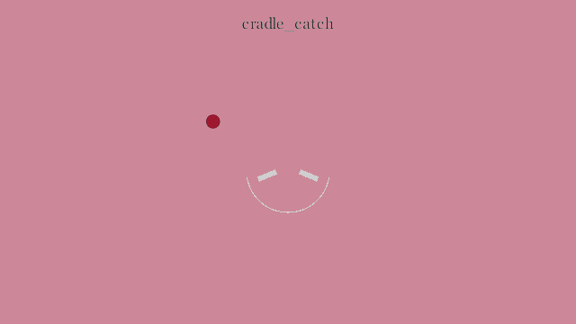 | Lower catch basin and support pads for landing or settling scenes. |
| `balance_beam` | 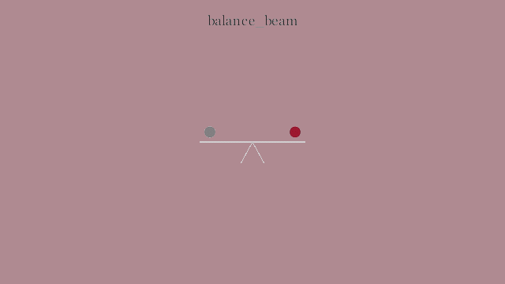 | Fulcrum and beam primitive for counterweight and counterlift balance scenes. |
| `deformation_wave` | 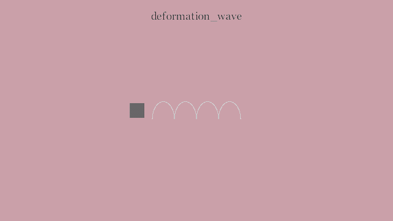 | Elastic wave guide for deformation, flex, and shape-change proof beats. |
| `settle_echo` | 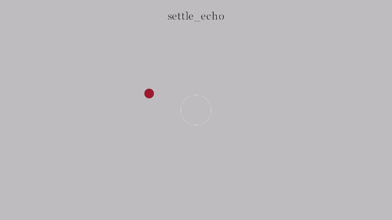 | Concentric settling rings for echo, impact, and delayed-resolution scenes. |
| `edge_tension_marker` | 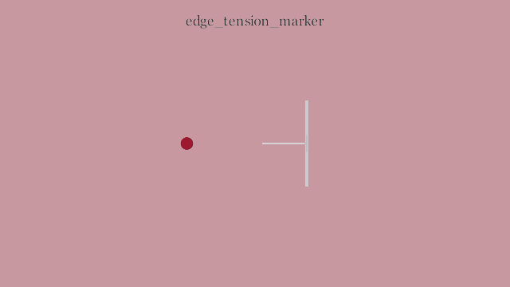 | Boundary wall and tether marker for edge-pressure compositions. |
| `keystone_lock` | 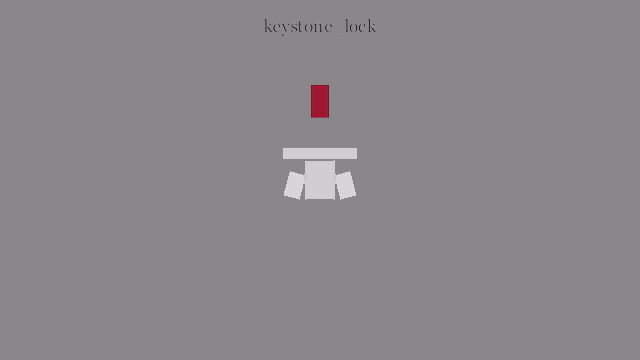 | Central locking block with side supports for keystone-style closures. |
| `latch_anchor` | 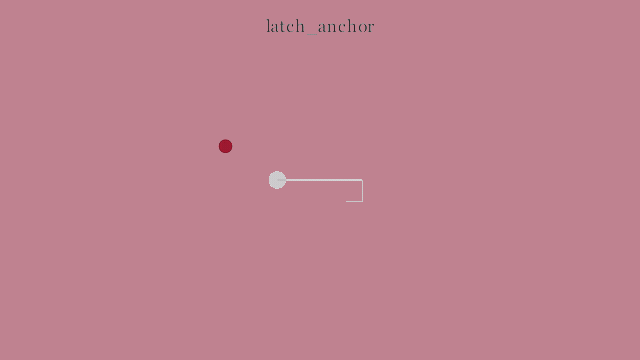 | Anchor dot and hook path for latched handoff scenes. |
| `layered_stack` | 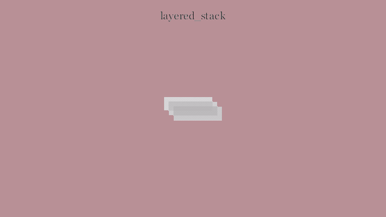 | Offset layer stack for progressive reveal and peel-style compositions. |
| `magnet_capture` | 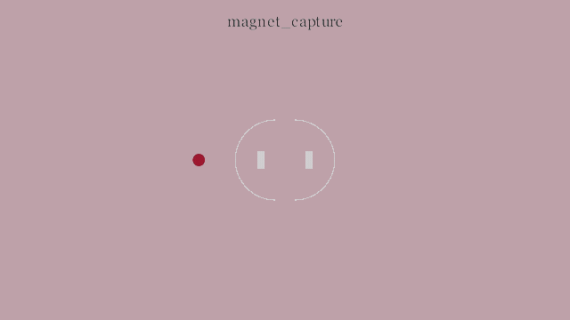 | Opposing capture arcs and poles for magnetic attraction scenes. |
| `negative_space_frame` | 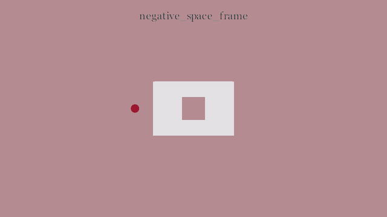 | Four-part frame that leaves an intentional central opening. |
| `parallax_planes` | 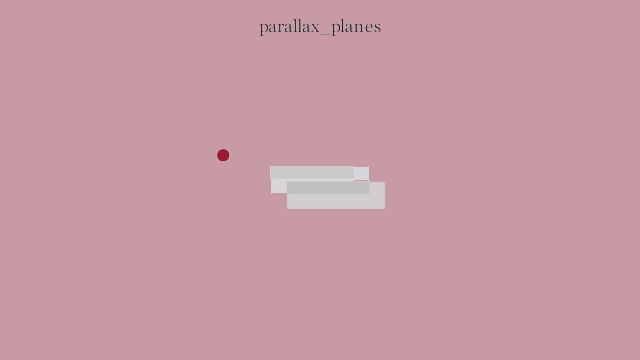 | Offset depth planes for parallax transfer and layered motion scenes. |
| `occlusion_peel` | 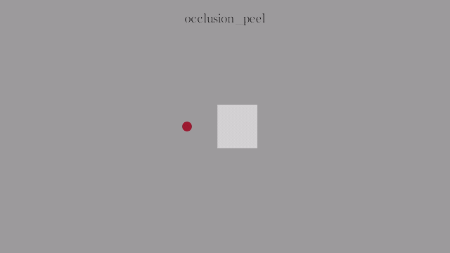 | Cover panel and reveal lip for occlusion and peel-away scenes. |
| `relay_nodes` | 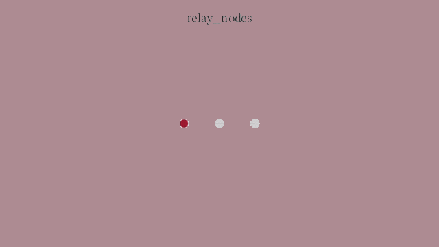 | Evenly spaced handoff nodes for relay and ownership transfer scenes. |
| `rhythm_gate_marks` | 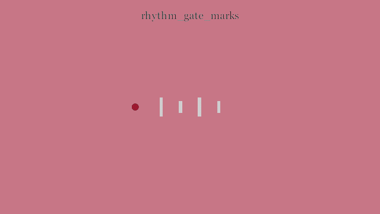 | Cadence marks on a rail for rhythm and gated timing scenes. |
| `shear_rails` | 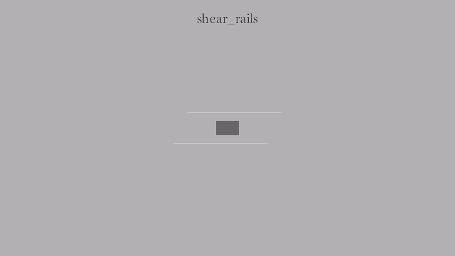 | Offset rails and body marker for shear and lateral-resolve scenes. |
| `sling_arc` | 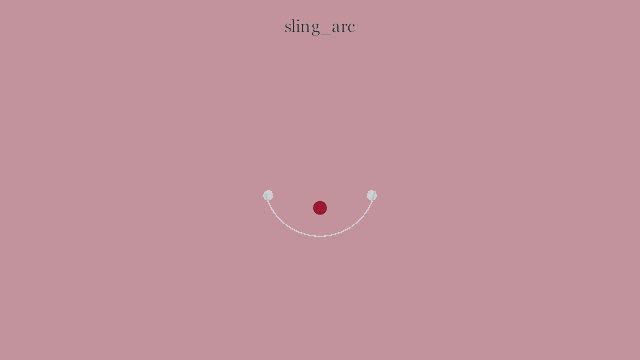 | Anchored release arc for sling and launch-motion scenes. |
| `snap_recoil_stop` | 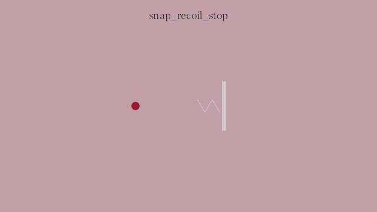 | Spring-like recoil cue with a pressure stop for snap-back scenes. |
| `convergence_lane` | 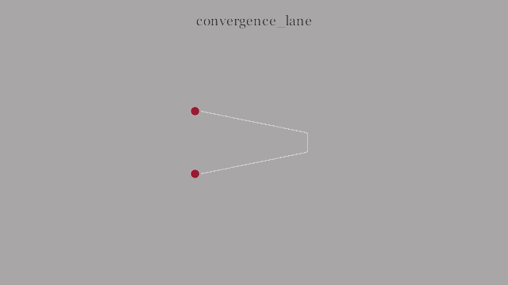 | Narrowing lane for staged convergence and compression proofs. |
| `weave_crossing` | 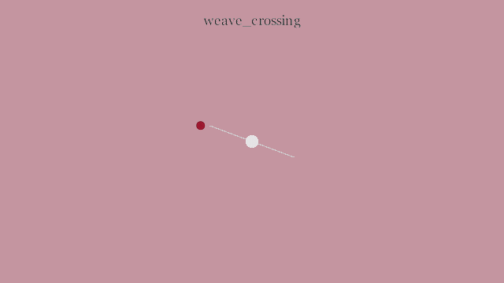 | Separated crossing strokes for over-under weave explanations. |
| `receiver_slot` | 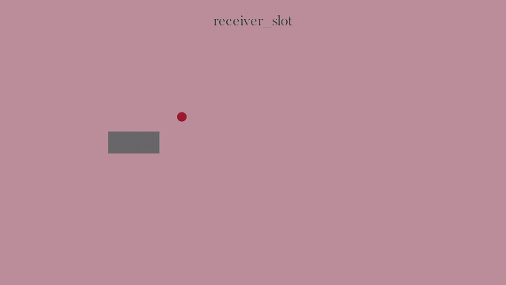 | Composite receiver-slot pattern with pending outline, moving payload, and terminal mark. |
| `rhythm_gate` | 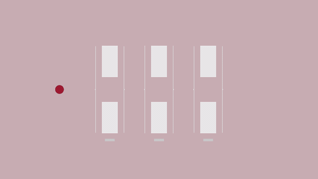 | Composite cadence pattern using several gate columns along a rail. |

## `slab`

Solid rectangular block used for bars, rails, cards, and resolved payloads.


## `pulse`

Primary-red active actor used to carry handoffs, routes, and proof beats.


## `open_slot`

Open receiver outline that reserves a destination without enclosing the actor.


## `source_slot`

Bracketed launch slot for a source-side active actor.


## `target_slot`

Mirrored bracketed landing slot for a receiver-side active actor.


## `bridge_lane`

Guided transfer lane between source and destination zones.


## `gate_column`

Prepared vertical gate that opens around the active actor.


## `time_rail`

Left-side timeline rail that narrates progressive card activation.


## `mask_window`

Moving mask window that reveals transferred outputs.


## `terminal_brackets`

Separated corner marks used as a terminal resolved-state cue.


## `terminal_brackets_around`

Convenience wrapper that sizes terminal brackets around a target cluster.


## `neutral_cluster`

Reusable quiet gray payload cluster for transfer and resolve demos.


## `aperture_shutters`

Reusable opening shutters extracted from aperture-style transition spikes.


## `merge_funnel`

Converging guide rails for combining two inputs into one output.


## `orbit_guides`

Circular guide marks for anchored orbit and return-motion explanations.


## `fork_guides`

Branching guide rails for diverging one active actor into parallel outcomes.


## `pressure_wall`

Compact resistance marker for pressure, constraint, and boundary-contact scenes.


## `clamp_pair`

Opposing vertical clamp bars extracted from compression and clamp-close spikes.


## `sleeve_channel`

Three-sided reveal sleeve for contained payload transitions.


## `ramp_plane`

Inclined support plane for lift, ramp, and assisted-transfer scenes.


## `fan_guides`

Radial guide set for fan-out, splay, and multi-target distribution scenes.


## `hinge_pivot`

Pivot, arm, and arc guide for hinge or swing-motion explanations.


## `arc_handoff`

Curved route with source and target points for arced handoff scenes.


## `bumper_stop`

Angled stop and wall for deflecting an active actor away from a boundary.


## `compression_channel`

Narrow parallel rails for squeezing or releasing a payload.


## `corridor_rails`

Long guide rails with a central squeeze point for corridor passages.


## `cradle_catch`

Lower catch basin and support pads for landing or settling scenes.


## `balance_beam`

Fulcrum and beam primitive for counterweight and counterlift balance scenes.


## `deformation_wave`

Elastic wave guide for deformation, flex, and shape-change proof beats.


## `settle_echo`

Concentric settling rings for echo, impact, and delayed-resolution scenes.


## `edge_tension_marker`

Boundary wall and tether marker for edge-pressure compositions.


## `keystone_lock`

Central locking block with side supports for keystone-style closures.


## `latch_anchor`

Anchor dot and hook path for latched handoff scenes.


## `layered_stack`

Offset layer stack for progressive reveal and peel-style compositions.


## `magnet_capture`

Opposing capture arcs and poles for magnetic attraction scenes.


## `negative_space_frame`

Four-part frame that leaves an intentional central opening.


## `parallax_planes`

Offset depth planes for parallax transfer and layered motion scenes.


## `occlusion_peel`

Cover panel and reveal lip for occlusion and peel-away scenes.


## `relay_nodes`

Evenly spaced handoff nodes for relay and ownership transfer scenes.


## `rhythm_gate_marks`

Cadence marks on a rail for rhythm and gated timing scenes.


## `shear_rails`

Offset rails and body marker for shear and lateral-resolve scenes.


## `sling_arc`

Anchored release arc for sling and launch-motion scenes.


## `snap_recoil_stop`

Spring-like recoil cue with a pressure stop for snap-back scenes.


## `convergence_lane`

Narrowing lane for staged convergence and compression proofs.


## `weave_crossing`

Separated crossing strokes for over-under weave explanations.


## `receiver_slot`

Composite receiver-slot pattern with pending outline, moving payload, and terminal mark.


## `rhythm_gate`

Composite cadence pattern using several gate columns along a rail.


