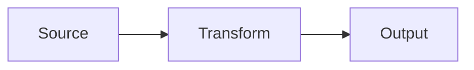

# Mermaid plus motion

The diagram states the flow. The Manim video reinforces it with movement.

::left::

::right::

  <video class="h-full w-full object-contain bg-transparent pointer-events-none" autoplay loop muted playsinline preload="auto" :poster="spikePoster">
    <source :src="spikeVideo" type="video/webm" />
  </video>

