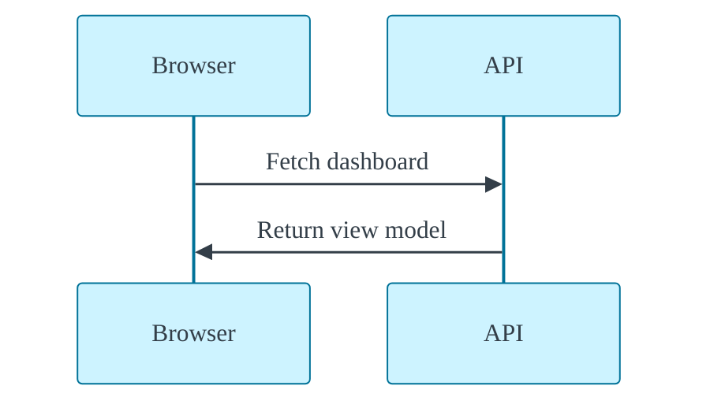
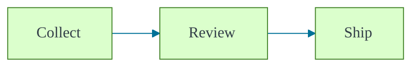
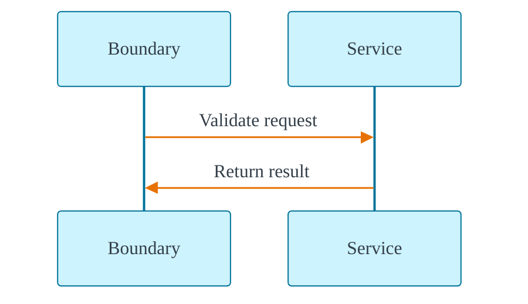
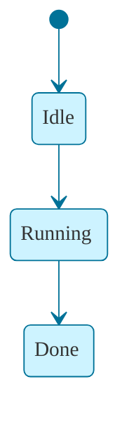
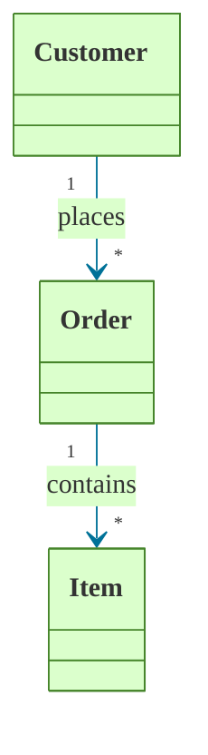
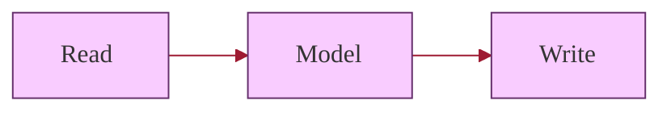
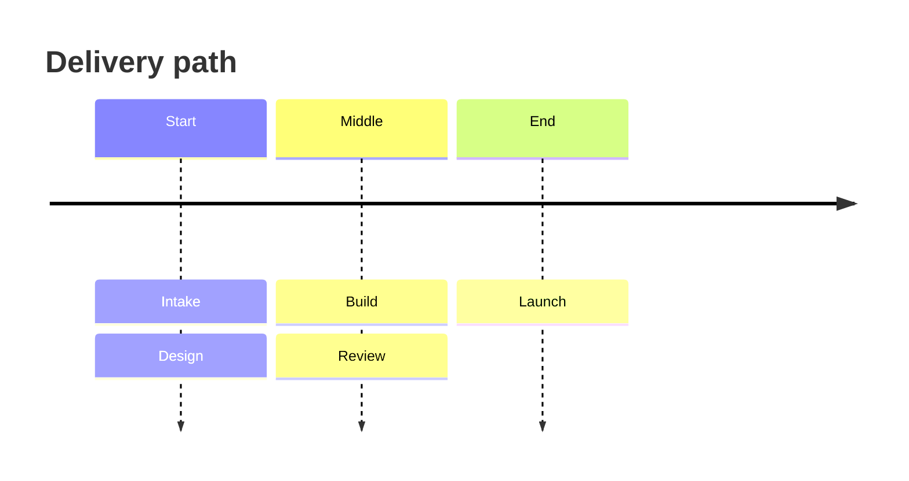
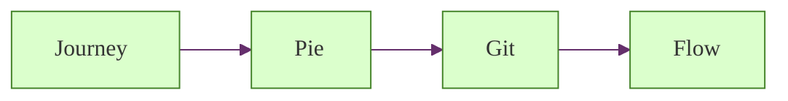
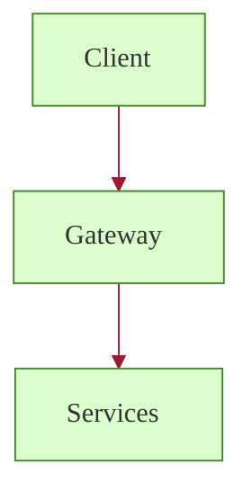
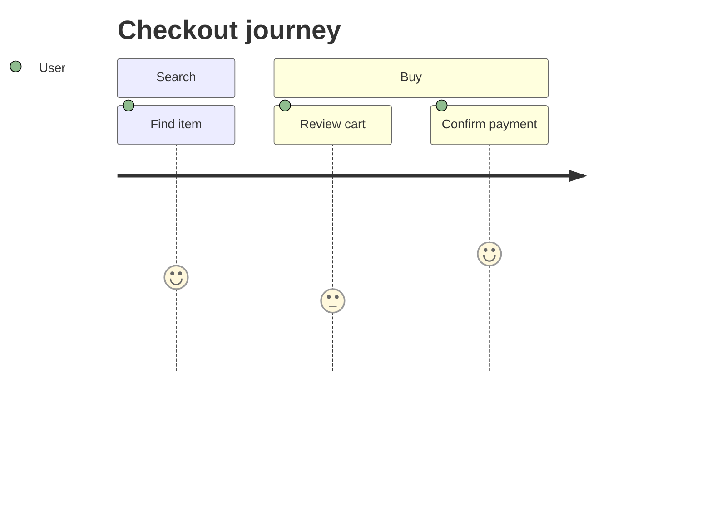

# Mermaid Layout Gallery

Every established slide pattern in this repository, now paired with a distinct Mermaid diagram and a transparent Manim video.

  
Primary green

  
Primary blue

  
Primary orange

  
Primary red

  
Primary purple

---
layout: full
---

  <video class="h-full w-full object-cover" autoplay loop muted playsinline preload="auto" :poster="bgPoster">
    <source :src="bgVideo" type="video/webm" />
  </video>

  
Background loop layer

  <h1 class="mt-4 text-4xl font-semibold leading-tight" style="color:#333E48;">Ambient motion behind a Mermaid sequence.</h1>

---
layout: full
---

  
Corner callout

  <h1 class="mt-4 max-w-4xl text-4xl font-semibold leading-tight" style="color:#333E48;">Main diagram plus a small motion accent.</h1>

  <video class="h-full w-full object-contain bg-transparent" autoplay loop muted playsinline preload="auto" :poster="calloutPoster">
    <source :src="calloutVideo" type="video/webm" />
  </video>

---
layout: two-cols
---

# Side by side

Diagram and animation split the slide evenly.

::left::

::right::

  <video class="h-full w-full object-contain bg-transparent pointer-events-none" autoplay loop muted playsinline preload="auto" :poster="sidePoster">
    <source :src="sideVideo" type="video/webm" />
  </video>

---
layout: two-cols
---

# Inset annotation

The main video explains the state change while the inset isolates one detail.

::left::

::right::

  <video class="h-full w-full object-contain bg-transparent pointer-events-none" autoplay loop muted playsinline preload="auto" :poster="insetMainPoster">
    <source :src="insetMain" type="video/webm" />
  </video>
  

    <video class="aspect-square w-full object-contain bg-transparent pointer-events-none" autoplay loop muted playsinline preload="auto" :poster="insetDetailPoster">
      <source :src="insetDetail" type="video/webm" />
    </video>
  

---
layout: two-cols
---

# Compare two approaches

Two related diagrams stay readable when each side owns its own panel and motion.

::left::

  <video class="h-[140px] w-full object-contain bg-transparent pointer-events-none" autoplay loop muted playsinline preload="auto" :poster="compareLeftPoster">
    <source :src="compareLeft" type="video/webm" />
  </video>

::right::

  <video class="h-[140px] w-full object-contain bg-transparent pointer-events-none" autoplay loop muted playsinline preload="auto" :poster="compareRightPoster">
    <source :src="compareRight" type="video/webm" />
  </video>

---
layout: two-cols
---

# Timeline stack

The vertical lane carries the narrative while Mermaid supplies the milestones.

::left::

::right::

  <video class="h-full w-full object-contain bg-transparent pointer-events-none" autoplay loop muted playsinline preload="auto" :poster="timelinePoster">
    <source :src="timelineVideo" type="video/webm" />
  </video>

---
layout: full
---

# Multi-video grid

Several diagram stories can coexist when each tile owns its own transparent loop.

  

    
Journey

    <video class="h-[70px] w-full object-contain bg-transparent pointer-events-none" autoplay loop muted playsinline preload="auto" :poster="gridJourneyPoster">
      <source :src="gridJourney" type="video/webm" />
    </video>
  

  

    
Pie

    <video class="h-[70px] w-full object-contain bg-transparent pointer-events-none" autoplay loop muted playsinline preload="auto" :poster="gridPiePoster">
      <source :src="gridPie" type="video/webm" />
    </video>
  

  

    
Git

    <video class="h-[70px] w-full object-contain bg-transparent pointer-events-none" autoplay loop muted playsinline preload="auto" :poster="gridGitPoster">
      <source :src="gridGit" type="video/webm" />
    </video>
  

  

    
Flow

    <video class="h-[70px] w-full object-contain bg-transparent pointer-events-none" autoplay loop muted playsinline preload="auto" :poster="gridFlowPoster">
      <source :src="gridFlow" type="video/webm" />
    </video>
  

---
layout: two-cols
---

# Hero plus support

One hero diagram owns the slide while a smaller loop reinforces the same vocabulary.

::left::

::right::

  

    <video class="h-full w-full object-contain bg-transparent pointer-events-none" autoplay loop muted playsinline preload="auto" :poster="heroMainPoster">
      <source :src="heroMain" type="video/webm" />
    </video>
  

  

    <video class="aspect-square w-full object-contain bg-transparent pointer-events-none" autoplay loop muted playsinline preload="auto" :poster="heroSupportPoster">
      <source :src="heroSupport" type="video/webm" />
    </video>
    
The support loop keeps the same motion language without competing with the main diagram.

  

---
layout: two-cols
---

# Device frame embed

UI framing helps when the Manim explanation belongs inside an application surface.

::left::

::right::

  

    

      

      

      

    

    
app.example / checkout

  

  

    <video class="h-[200px] w-full object-contain bg-transparent pointer-events-none" autoplay loop muted playsinline preload="auto" :poster="deviceFramePoster">
      <source :src="deviceFrame" type="video/webm" />
    </video>
  

