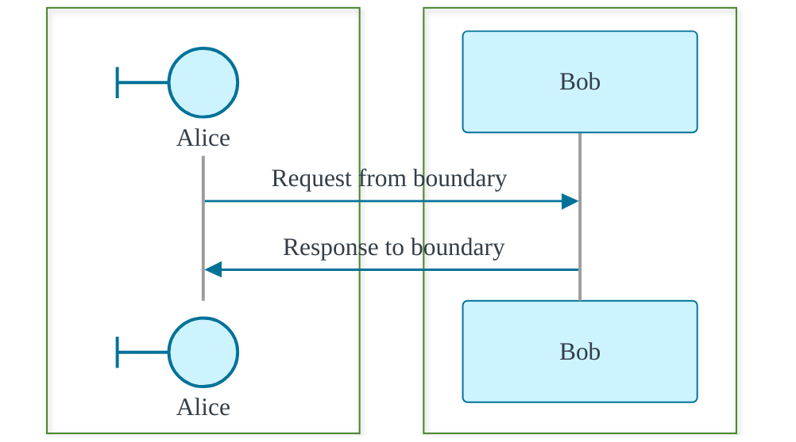

# Boundary request and response

The boundary participant starts the interaction. Bob processes it and sends the response back.

  
Boundary

  
Service

  
Request

  
Response

::left::

  

    Alice is the boundary entry point.
  

  

    Bob is the collaborating actor that receives the request and returns the response.
  

  

    Request goes from the boundary to the service.
  

  

    Response returns from the service to the boundary.
  

::right::

  

    
Request animation

    
Response animation

  

  

  <video class="h-full w-full object-contain bg-transparent pointer-events-none" autoplay loop muted playsinline preload="auto" :poster="spikePoster">
    <source :src="spikeVideo" type="video/webm" />
  </video>
  

