# Slidev Transition Showcase

::left::

<p class="kicker">Transition map</p>

```ts {2-8}
const builtIns = [
  'fade',
  'fade-out',
  'slide-left',
  'slide-right',
  'slide-up',
  'slide-down',
  'view-transition',
]
```

<div class="fade-proof fade-proof-source">
  <strong>fade</strong>
  <span>source fades away</span>
</div>

::right::

<p class="kicker">Deck path</p>

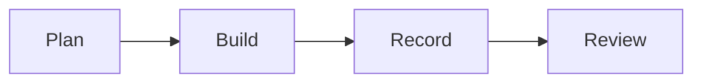

---
transition: fade-out
layout: two-cols
---

# Fade

::left::

<p class="kicker">Code highlighting</p>

```ts {none|1-4|6|8-9|all}
type SlideAsset = {
  kind: 'code' | 'diagram' | 'video'
  priority: number
}

const assets: SlideAsset[] = [
  { kind: 'code', priority: 1 },
  { kind: 'diagram', priority: 1 },
]
```

<div class="badge-row">
  <span class="badge blue">fade</span>
  <span class="badge green">code</span>
  <span class="badge orange">Mermaid</span>
</div>

<div class="fade-proof fade-proof-target">
  <strong>fade</strong>
  <span>target fades in</span>
</div>

::right::

<p class="kicker">Flowchart</p>

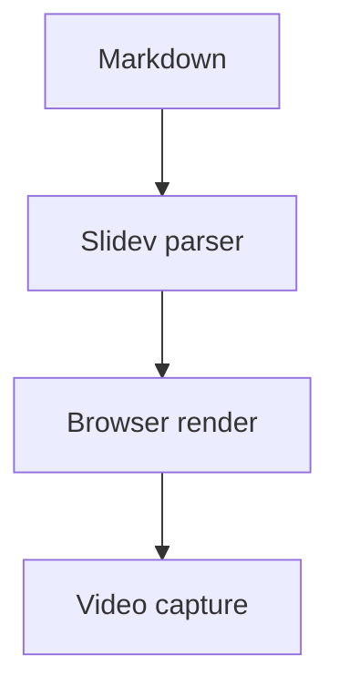

---
transition: slide-left
layout: two-cols
---

# Fade Out

::left::

<p class="kicker">Vue state</p>

```vue {none|2|3-7|all}
<script setup lang="ts">
const slide = ref({
  transition: 'fade-out',
  seconds: 3,
  status: 'ready',
})
</script>
```

<div class="badge-row">
  <span class="badge orange">reactive</span>
  <span class="badge blue">browser</span>
  <span class="badge purple">timed</span>
</div>

<div class="fade-proof fadeout-proof-target">
  <strong>fade-out</strong>
  <span>target appears after source clears</span>
</div>

::right::

<p class="kicker">Sequence</p>

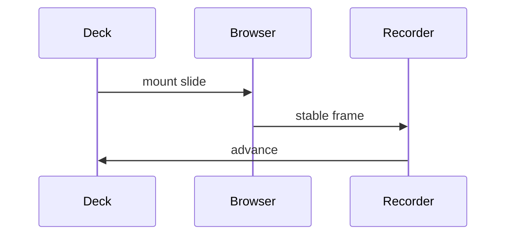

---
transition: slide-right
layout: two-cols
---

# Slide Left

::left::

<p class="kicker">Route data</p>

```yaml {3,5,8-9}
slides:
  - path: /2
    transition: fade
  - path: /4
    transition: slide-left
recording:
  secondsPerSlide: 3
  secondsPerClick: 1.6
  viewTransitionMs: 2200
```

<div class="badge-row">
  <span class="badge green">routes</span>
  <span class="badge yellow">YAML</span>
  <span class="badge blue">left</span>
</div>

::right::

<p class="kicker">Class diagram</p>

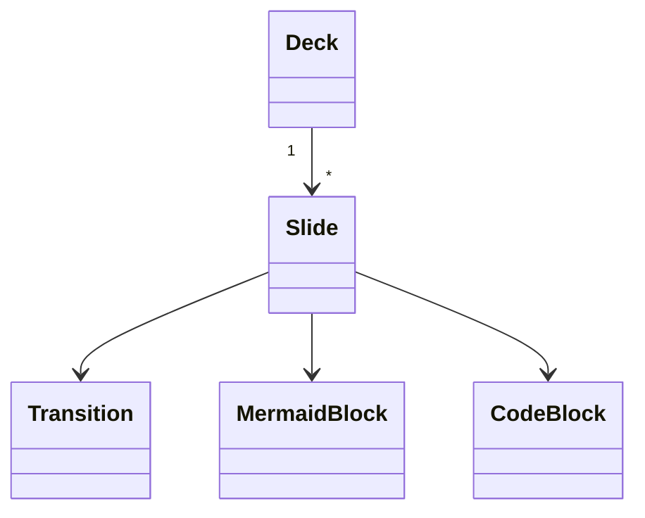

---
transition: slide-up
layout: two-cols
---

# Slide Right

::left::

<p class="kicker">Math plus code</p>

```py {none|1|2|3|all}
def hold_time(slides: int, seconds: int = 3) -> int:
    transition_buffer = max(slides - 1, 0)
    return slides * seconds + transition_buffer
```

$$T = n \times 3s + (n - 1)b$$

::right::

<p class="kicker">State diagram</p>

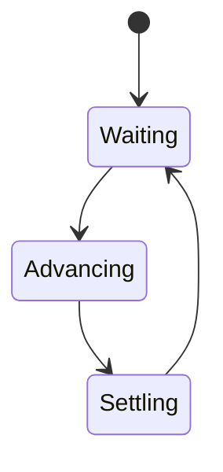

---
transition: slide-down
layout: two-cols
---

# Slide Up

::left::

<p class="kicker">Table data</p>

```json {2-4}
{
  "format": "webm",
  "viewport": [1280, 720],
  "checks": ["build", "screenshots", "duration"]
}
```

| Check | Target |
| --- | --- |
| Build | Slidev SPA |
| Video | WebM |
| Review | PNG frames |

::right::

<p class="kicker">ER diagram</p>

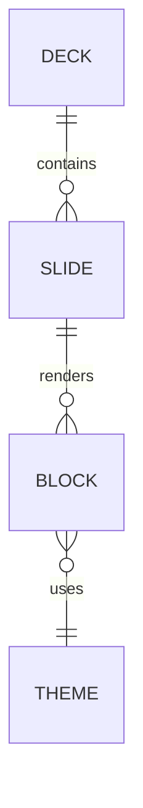

---
transition: view-transition
layout: two-cols
---

# Slide Down

::left::

<p class="kicker">View transition source</p>

```css {2,6}
.shared-token {
  view-transition-name: slidev-capability-token;
  background: #652f6c;
  color: white;
}
::view-transition-group(slidev-capability-token) {
  animation-duration: 2.2s;
}
```

<div class="view-token-stage source">
  <span class="route-node view-route-source">source</span>
  <span class="shared-token view-source-token">Capability</span>
</div>

::right::

<p class="kicker">Timeline</p>

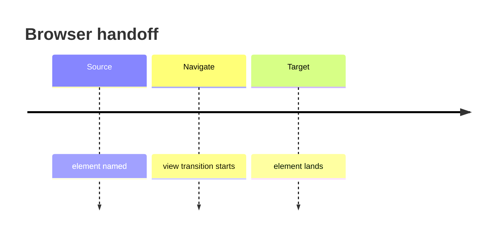

---
transition: pulse-route
layout: two-cols
---

# View Transition

::left::

<p class="kicker">Shared target</p>

```html {1,2}
<div class="shared-token view-target-token"
     style="view-transition-name: slidev-capability-token">
  Capability
</div>
```

<div class="view-token-stage target">
  <span class="shared-token view-target-token">Capability</span>
  <span class="route-node view-route-target">target</span>
</div>

::right::

<p class="kicker">Journey</p>

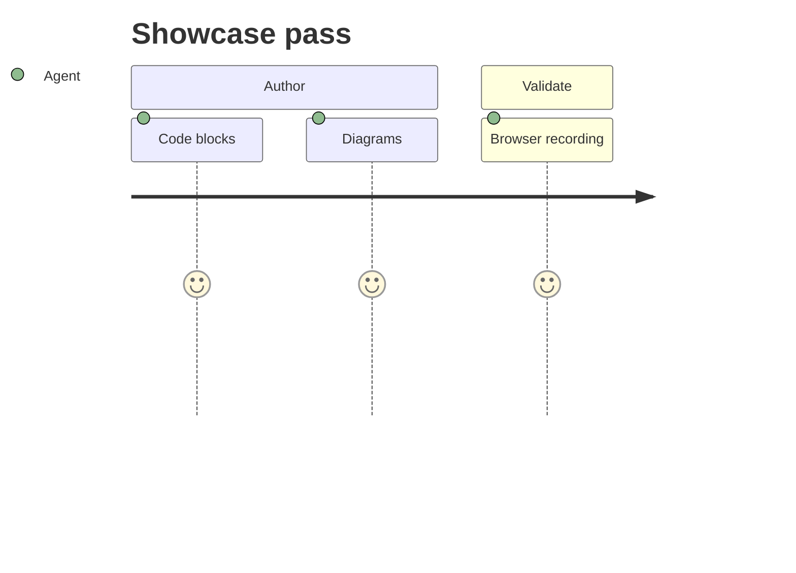

---
transition: fade
layout: two-cols
---

# Custom Transition

::left::

<p class="kicker">Vue transition classes</p>

```css {1-7|9-14|16-21}
.pulse-route-enter-active,
.pulse-route-leave-active {
  transition:
    transform 1.6s cubic-bezier(.16, .82, .18, 1),
    clip-path 1.6s cubic-bezier(.16, .82, .18, 1),
    filter 1.6s ease;
}
.pulse-route-enter-from {
  opacity: 0;
  transform: translateX(34vw) scale(.76) rotate(5deg);
  filter: blur(14px);
  clip-path: polygon(100% 0, 100% 0, 100% 100%, 100% 100%);
}
.pulse-route-leave-to {
  opacity: 0;
  transform: translateX(-28vw) scale(1.12) rotate(-4deg);
  filter: blur(10px);
  clip-path: polygon(0 0, 0 0, 0 100%, 0 100%);
}
```

<div class="badge-row">
  <span class="badge red">custom</span>
  <span class="badge blue">Vue</span>
  <span class="badge green">recorded</span>
</div>

<div class="custom-route-proof">
  <span>clip-path</span>
  <span>rotate</span>
  <span>blur</span>
</div>

::right::

<p class="kicker">Git graph</p>

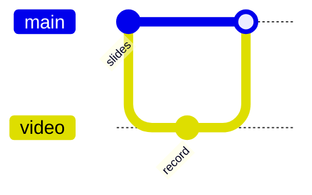

---
transition: zoom-route
layout: two-cols
---

# Click Directives

::left::

<p class="kicker">Reveal, after, range, hide</p>

<pre class="manual-code"><code>
<span :class="{ 'manual-highlight': $clicks === 1 }">&lt;div v-click&gt;v-click&lt;/div&gt;</span>
<span :class="{ 'manual-highlight': $clicks === 1 }">&lt;div v-after&gt;v-after&lt;/div&gt;</span>
<span></span>
<span :class="{ 'manual-highlight': $clicks >= 2 && $clicks < 4 }">&lt;div v-click="[2, 4]"&gt;</span>
<span :class="{ 'manual-highlight': $clicks >= 2 && $clicks < 4 }">  range 2-3</span>
<span :class="{ 'manual-highlight': $clicks >= 2 && $clicks < 4 }">&lt;/div&gt;</span>
<span></span>
<span :class="{ 'manual-highlight': $clicks === 4 }">&lt;div v-click-hide="4"&gt;</span>
<span :class="{ 'manual-highlight': $clicks === 4 }">  hidden starting at 4</span>
<span :class="{ 'manual-highlight': $clicks === 4 }">&lt;/div&gt;</span>
</code></pre>

<div class="click-card-grid">
  <div class="click-card blue" v-click>v-click</div>
  <div class="click-card green" v-after>v-after</div>
  <div class="click-card purple" v-click="[2, 4]">range 2-3</div>
  <div class="click-card red" v-click-hide="4">hide at 4</div>
</div>

::right::

<p class="kicker">Click lifecycle</p>

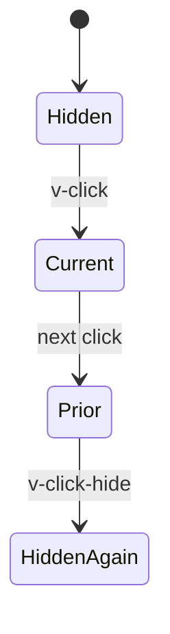

---
transition: rotate-route
layout: two-cols
---

# List Clicks

::left::

<p class="kicker">v-clicks component</p>

<pre class="manual-code"><code>
<span>&lt;v-clicks depth="2"&gt;</span>
<span></span>
<span :class="{ 'manual-highlight': $clicks === 1 }">- Plan the route</span>
<span :class="{ 'manual-highlight': $clicks === 2 }">  - include nested context</span>
<span :class="{ 'manual-highlight': $clicks === 3 }">- Render the browser</span>
<span :class="{ 'manual-highlight': $clicks === 4 }">- Record the clicks</span>
<span :class="{ 'manual-highlight': $clicks === 5 }">- Review the frames</span>
<span></span>
<span>&lt;/v-clicks&gt;</span>
</code></pre>

<v-clicks depth="2">

- Plan the route
  - include nested context
- Render the browser
- Record the clicks
- Review the frames

</v-clicks>

::right::

<p class="kicker">Dependency graph</p>

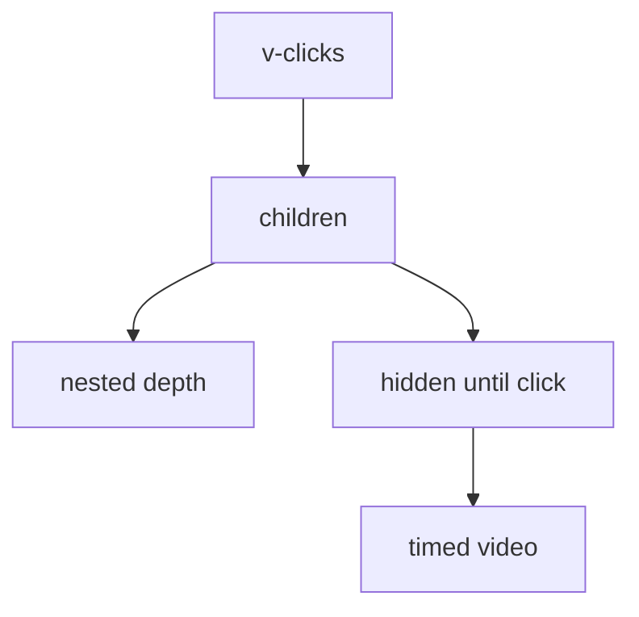

---
transition: curtain-route
layout: two-cols
---

# Switch States

::left::

<p class="kicker">v-switch state machine</p>

<pre class="manual-code"><code>
<span>&lt;v-switch at="+0" transition="slide-left"&gt;</span>
<span :class="{ 'manual-highlight': $clicks === 0 }">  &lt;template #1&gt;Parse&lt;/template&gt;</span>
<span :class="{ 'manual-highlight': $clicks === 1 }">  &lt;template #2&gt;Render&lt;/template&gt;</span>
<span :class="{ 'manual-highlight': $clicks >= 2 }">  &lt;template #3&gt;Record&lt;/template&gt;</span>
<span>&lt;/v-switch&gt;</span>
</code></pre>

<v-switch at="+0" transition="slide-left" class="switch-shell" child-tag="section">
  <template #1>
    <div class="switch-state blue">Parse Markdown</div>
  </template>
  <template #2>
    <div class="switch-state green">Render Browser</div>
  </template>
  <template #3>
    <div class="switch-state orange">Record Video</div>
  </template>
</v-switch>

::right::

<p class="kicker">Switch diagram</p>

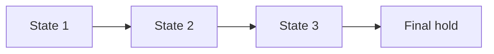

---
transition: blur-route
layout: two-cols
---

# Motion Directives

::left::

<p class="kicker">v-motion enter and click variants</p>

```html {1-4|5|6|7}
<div
  v-motion
  :initial="{ opacity: 0, x: -120, scale: 0.9 }"
  :enter="{ opacity: 1, x: 0, scale: 1 }"
  :click-1="{ x: 160 }"
  :click-2="{ x: 160, rotate: 8, scale: 1.12 }"
  :click-3="{ x: 40, rotate: 0, scale: 1 }"
/>
```

<div class="motion-stage">
  <div
    class="motion-token"
    v-motion
    :initial="{ opacity: 0, x: -120, scale: 0.9 }"
    :enter="{ opacity: 1, x: 0, scale: 1 }"
    :click-1="{ x: 160 }"
    :click-2="{ x: 160, rotate: 8, scale: 1.12 }"
    :click-3="{ x: 40, rotate: 0, scale: 1 }"
  >
    v-motion
  </div>
</div>

::right::

<p class="kicker">Motion timeline</p>

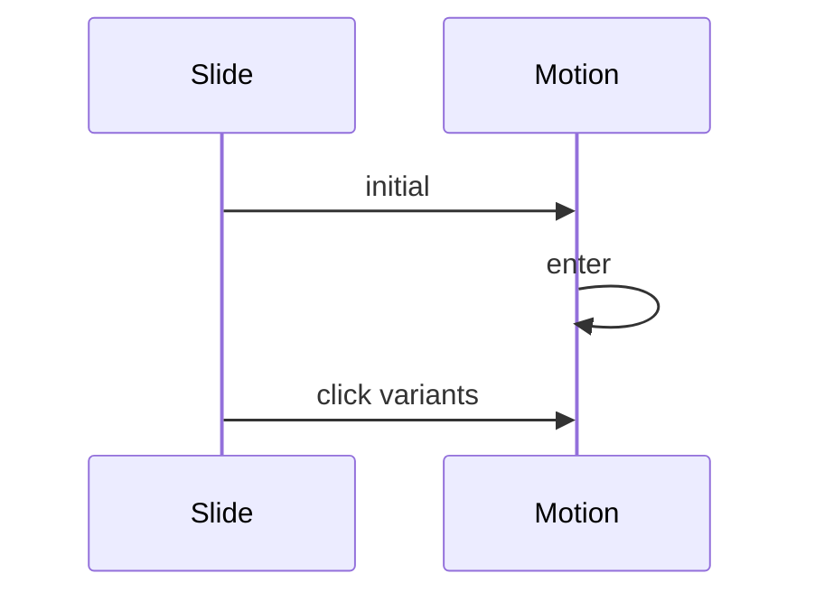

---
transition: diagonal-route
layout: two-cols
---

# Magic Move

::left::

<p class="kicker">Shiki code motion</p>

````md magic-move {duration: 900, lines: true}
```ts
const deck = markdown()
```

```ts
const deck = markdown()
const slides = parse(deck)
```

```ts
const deck = markdown()
const slides = parse(deck)
const video = await record(slides)
```

```ts
const deck = markdown()
const slides = parse(deck)
const video = await record(slides)
await review(video)
```
````

::right::

<p class="kicker">Code morph path</p>

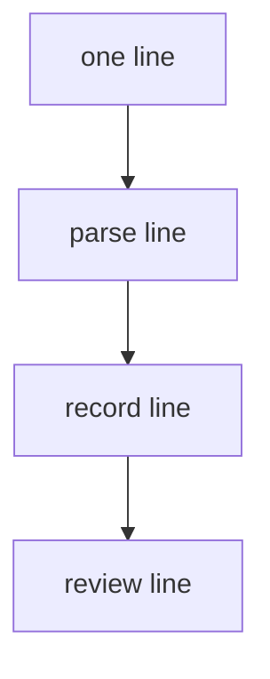

---
transition: stack-route
layout: two-cols
---

# Rough Markers

::left::

<p class="kicker">v-mark annotations</p>

```html {none|1-3|5-7|9-11|13-15}
<span v-mark.underline.red="1">
  underline on click 1
</span>

<span v-mark.circle.blue="2">
  circle on click 2
</span>

<span v-mark.highlight.yellow="3">
  highlight on click 3
</span>

<span v-mark="{ at: 4, type: 'box', color: '#45842a' }">
  custom box on click 4
</span>
```

<div class="marker-stage">
  <span v-mark.underline.red="1">underline</span>
  <span v-mark.circle.blue="2">circle</span>
  <span v-mark.highlight.yellow="3">highlight</span>
  <span v-mark="{ at: 4, type: 'box', color: '#45842a' }">box</span>
</div>

::right::

<p class="kicker">Annotation path</p>

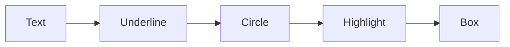

---
transition: fade
layout: two-cols
---

# Animation Coverage

::left::

<p class="kicker">Contained in this recording</p>

```ts {1-8}
const captured = {
  transitions: ['built-in', 'view-transition', 'custom'],
  clickAnimations: ['v-click', 'v-after', 'v-click-hide'],
  components: ['v-clicks', 'v-switch'],
  motion: ['v-motion', 'magic-move', 'v-mark'],
  hold: '>= 3s per slide',
}
```

<div class="badge-row">
  <span class="badge blue">transitions</span>
  <span class="badge green">clicks</span>
  <span class="badge orange">motion</span>
  <span class="badge purple">code</span>
</div>

::right::

<p class="kicker">Full pass</p>

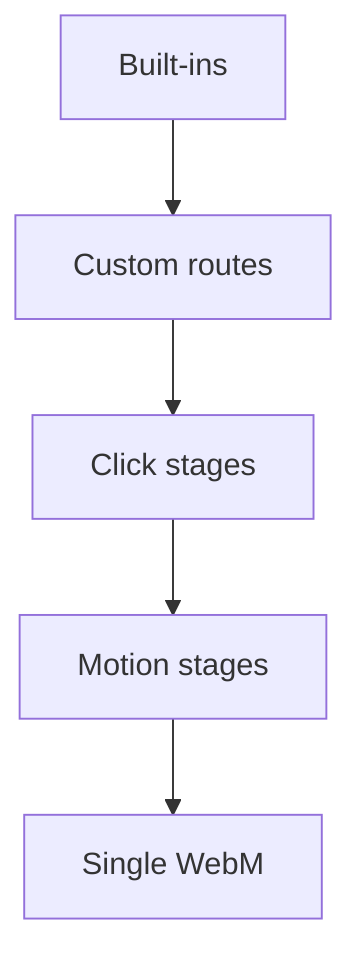
